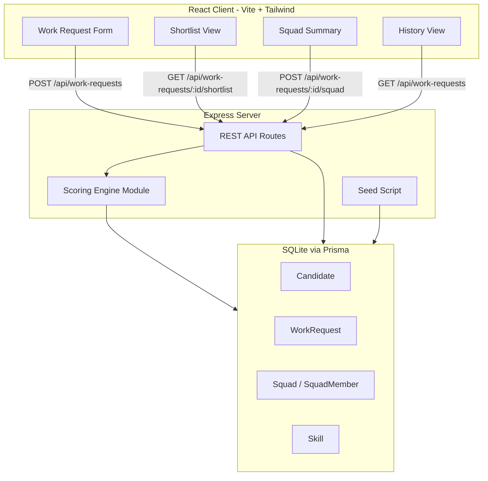
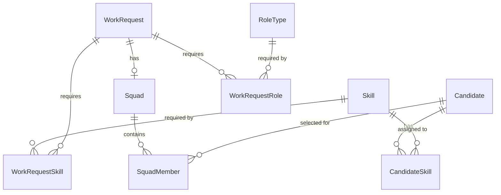

# Architecture: Squad Assembly

## Overview

Squad Assembly is an internal prototype that helps delivery leads rapidly assemble cross-functional squads for priority initiatives. The system comprises a React client for capturing work requests and viewing recommendations, an Express server hosting a rules-based scoring engine, and a SQLite database (via Prisma) storing mock talent pool data, work requests, and squad selections.

The core workflow is:
1. Delivery lead submits a work request (skills, roles, urgency, duration)
2. Scoring engine evaluates all candidates against the request using a weighted formula
3. Client displays a ranked shortlist with score breakdowns
4. Delivery lead selects candidates to form a squad
5. Squad is persisted and visible in work request history

This is a prototype scoped to a single business unit with mock data — no authentication, no real HR integration.

## System Architecture



## Key Design Decisions

| Decision | Rationale |
|----------|-----------|
| Scoring engine as a pure function module | Testable in isolation, no side effects, enables property-based testing |
| SQLite + Prisma | Zero-config database for prototype, Prisma provides type safety and migrations |
| No authentication | Prototype scope — single user assumed |
| Skills stored as a reference table | Enables predefined skill list and consistent matching |
| Score computed on-demand per request | No caching needed at prototype scale (< 1000 candidates) |
| React state via `useState` + fetch | Prototype simplicity — no state management library needed |

## Data Models

### Prisma Schema

```prisma
generator client {
  provider = "prisma-client-js"
}

datasource db {
  provider = "sqlite"
  url      = env("DATABASE_URL")
}

model Candidate {
  id                String   @id @default(cuid())
  name              String
  role              String
  availabilityBand  Int      // 0-100 percentage
  workloadIndicator Int      // 0-10 active engagements
  businessUnit      String
  createdAt         DateTime @default(now())

  skills       CandidateSkill[]
  squadMembers SquadMember[]
}

model Skill {
  id   String @id @default(cuid())
  name String @unique

  candidates         CandidateSkill[]
  workRequestSkills  WorkRequestSkill[]
}

model CandidateSkill {
  candidateId String
  skillId     String

  candidate Candidate @relation(fields: [candidateId], references: [id])
  skill     Skill     @relation(fields: [skillId], references: [id])

  @@id([candidateId, skillId])
}

model RoleType {
  id   String @id @default(cuid())
  name String @unique

  workRequestRoles WorkRequestRole[]
}

model WorkRequest {
  id            String   @id @default(cuid())
  title         String
  description   String
  urgencyLevel  String   // Critical | High | Medium | Low
  durationWeeks Int      // 1-104
  createdAt     DateTime @default(now())

  requiredSkills WorkRequestSkill[]
  requiredRoles  WorkRequestRole[]
  squad          Squad?
}

model WorkRequestSkill {
  workRequestId String
  skillId       String

  workRequest WorkRequest @relation(fields: [workRequestId], references: [id])
  skill       Skill       @relation(fields: [skillId], references: [id])

  @@id([workRequestId, skillId])
}

model WorkRequestRole {
  workRequestId String
  roleTypeId    String

  workRequest WorkRequest @relation(fields: [workRequestId], references: [id])
  roleType    RoleType    @relation(fields: [roleTypeId], references: [id])

  @@id([workRequestId, roleTypeId])
}

model Squad {
  id            String   @id @default(cuid())
  workRequestId String   @unique
  createdAt     DateTime @default(now())
  updatedAt     DateTime @updatedAt

  workRequest WorkRequest  @relation(fields: [workRequestId], references: [id])
  members     SquadMember[]
}

model SquadMember {
  squadId     String
  candidateId String

  squad     Squad     @relation(fields: [squadId], references: [id])
  candidate Candidate @relation(fields: [candidateId], references: [id])

  @@id([squadId, candidateId])
}
```

### Entity Relationships


