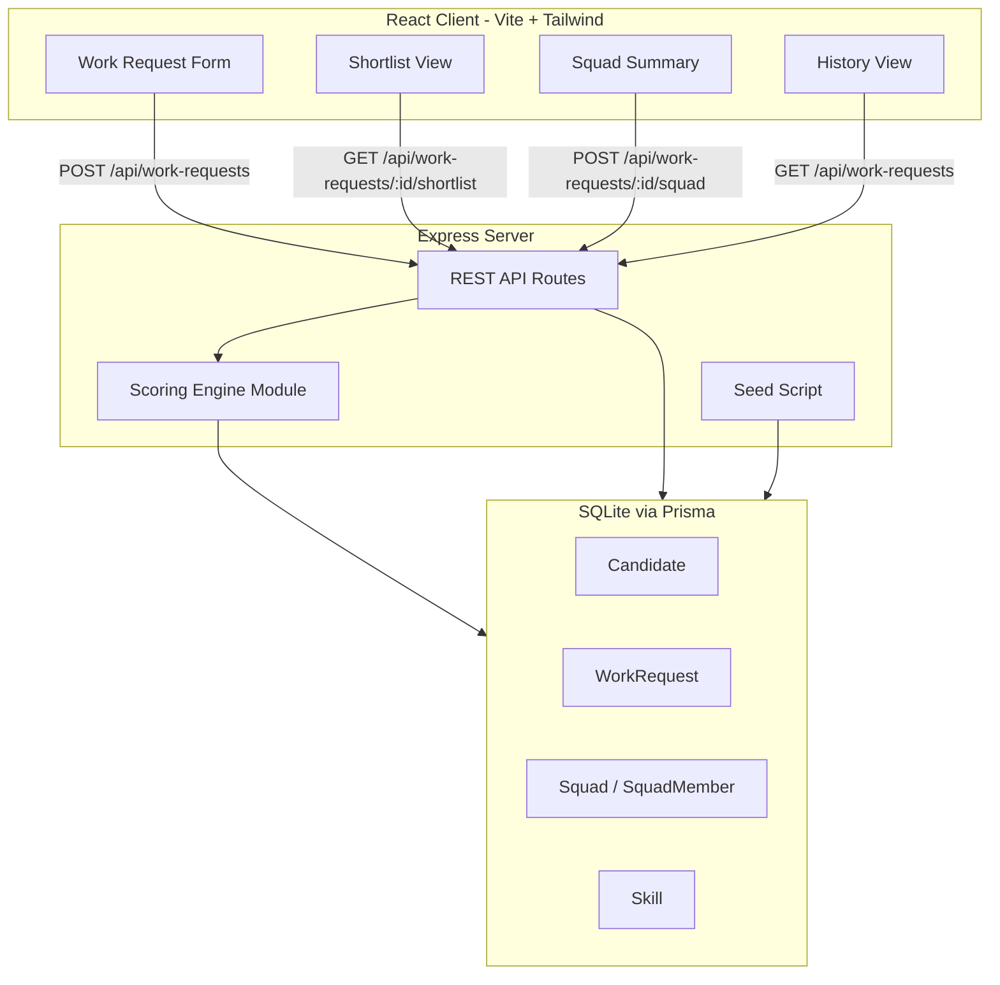
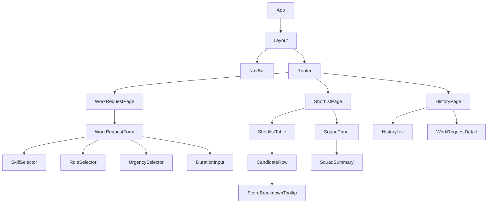
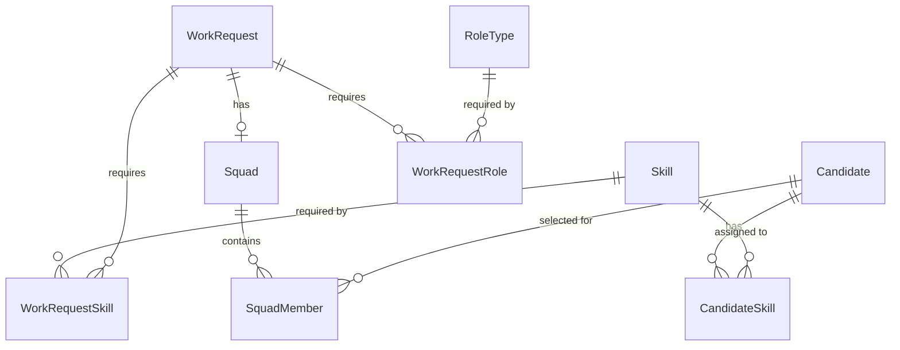

# Design Document: Squad Assembly

## Overview

Squad Assembly is an internal prototype that helps delivery leads rapidly assemble cross-functional squads for priority initiatives. The system comprises a React client for capturing work requests and viewing recommendations, an Express server hosting a rules-based scoring engine, and a SQLite database (via Prisma) storing mock talent pool data, work requests, and squad selections.

The core workflow is:
1. Delivery lead submits a work request (skills, roles, urgency, duration)
2. Scoring engine evaluates all candidates against the request using a weighted formula
3. Client displays a ranked shortlist with score breakdowns
4. Delivery lead selects candidates to form a squad
5. Squad is persisted and visible in work request history

This is a prototype scoped to a single business unit with mock data — no authentication, no real HR integration.

## Architecture



### Key Design Decisions

| Decision | Rationale |
|----------|-----------|
| Scoring engine as a pure function module | Testable in isolation, no side effects, enables property-based testing |
| SQLite + Prisma | Zero-config database for prototype, Prisma provides type safety and migrations |
| No authentication | Prototype scope — single user assumed |
| Skills stored as a reference table | Enables predefined skill list and consistent matching |
| Score computed on-demand per request | No caching needed at prototype scale (< 1000 candidates) |
| React state via `useState` + fetch | Prototype simplicity — no state management library needed |

## Components and Interfaces

### API Endpoints

| Method | Path | Description | Request Body | Response |
|--------|------|-------------|--------------|----------|
| `POST` | `/api/work-requests` | Create a work request | `WorkRequestInput` | `{ id, title, ... }` |
| `GET` | `/api/work-requests` | List work requests (paginated) | Query: `page`, `pageSize` | `{ data: [...], total, page, pageSize }` |
| `GET` | `/api/work-requests/:id` | Get work request details + squad | — | `WorkRequestDetail` |
| `GET` | `/api/work-requests/:id/shortlist` | Score and rank candidates | — | `{ candidates: ScoredCandidate[] }` |
| `POST` | `/api/work-requests/:id/squad` | Save/replace squad selection | `{ candidateIds: string[] }` | `{ squad: SquadSummary }` |
| `GET` | `/api/skills` | List all distinct skills | — | `{ skills: string[] }` |
| `GET` | `/api/roles` | List all distinct role types | — | `{ roles: string[] }` |

#### Request/Response Types

```typescript
// POST /api/work-requests
interface WorkRequestInput {
  title: string;            // 1-150 chars
  description: string;      // 0-2000 chars
  requiredSkills: string[]; // 1-20 skill names
  requiredRoles: string[];  // 1-10 role type names
  urgencyLevel: 'Critical' | 'High' | 'Medium' | 'Low';
  durationWeeks: number;    // 1-104
}

// GET /api/work-requests/:id/shortlist
interface ScoredCandidate {
  id: string;
  name: string;
  role: string;
  matchScore: number;         // 0-100 integer
  matchedSkills: string[];
  availabilityBand: number;   // 0-100
  workloadIndicator: number;  // 0-10
  breakdown: ScoreBreakdown;
}

interface ScoreBreakdown {
  skillMatch: number;       // percentage contribution
  roleAlignment: number;    // percentage contribution
  availability: number;     // percentage contribution
  workload: number;         // percentage contribution
}

// POST /api/work-requests/:id/squad
interface SquadSummary {
  workRequestId: string;
  workRequestTitle: string;
  members: { id: string; name: string; role: string }[];
  skillCoveragePercent: number; // 0-100
}
```

### React Component Hierarchy



#### Component Responsibilities

| Component | Responsibility |
|-----------|---------------|
| `WorkRequestForm` | Captures all work request fields, validates client-side, submits to API |
| `SkillSelector` | Multi-select from predefined skills (fetched from `/api/skills`), enforces 1-20 limit |
| `RoleSelector` | Multi-select from predefined roles (fetched from `/api/roles`), enforces 1-10 limit |
| `UrgencySelector` | Radio group for urgency levels, no default selected |
| `ShortlistTable` | Displays ranked candidates with checkboxes for squad selection |
| `CandidateRow` | Single candidate display with score, skills, availability indicator |
| `ScoreBreakdownTooltip` | Expandable score factor breakdown on click |
| `SquadPanel` | Shows selected candidates, skill coverage, confirm button |
| `HistoryList` | Paginated list of past work requests with status |
| `WorkRequestDetail` | Full details of a selected work request including squad if assembled |

### Scoring Engine Architecture

The scoring engine is a **pure function module** (`server/src/scoring/engine.ts`) with no database access — it receives data as arguments and returns scored results.

```typescript
// Core scoring function signature
export function scoreCandidate(
  candidate: CandidateData,
  workRequest: WorkRequestData
): ScoredResult | ValidationWarning;

// Orchestration function
export function rankCandidates(
  candidates: CandidateData[],
  workRequest: WorkRequestData
): RankingResult;

interface RankingResult {
  ranked: ScoredResult[];
  warnings: ValidationWarning[];
}
```

#### Scoring Formula

```
Match_Score = min(1.0, weighted_sum)

weighted_sum = (skill_match × 0.40)
             + (role_alignment × 0.20)
             + (availability × urgency_multiplier × 0.25)
             + (workload × 0.15)

Where:
  skill_match = |candidate_skills ∩ required_skills| / |required_skills|
  role_alignment = candidate_role ∈ required_roles ? 1.0 : 0.0
  availability = availability_band / 100 (normalised 0-1)
  workload = max(0, (5 - min(workload_indicator, 5)) / 5)
  urgency_multiplier = 1.5 if urgency ∈ {Critical, High} else 1.0
```

The final `Match_Score` is expressed as an integer percentage: `Math.round(Match_Score × 100)`.

### State Management Approach

For prototype simplicity, the client uses:

- **`useState`** for local component state (form fields, selections)
- **`useEffect` + `fetch`** for API calls with loading/error states
- **Custom hooks** to encapsulate API logic:
  - `useSkills()` — fetches available skills
  - `useRoles()` — fetches available roles
  - `useWorkRequests(page)` — paginated work request history
  - `useShortlist(workRequestId)` — fetches scored shortlist
  - `useSquadMutation()` — saves squad selection

No external state management library (Redux, Zustand) — the app has minimal cross-component state needs at this scale.

## Data Models

### Prisma Schema

```prisma
generator client {
  provider = "prisma-client-js"
}

datasource db {
  provider = "sqlite"
  url      = env("DATABASE_URL")
}

model Candidate {
  id                String   @id @default(cuid())
  name              String
  role              String
  availabilityBand  Int      // 0-100 percentage
  workloadIndicator Int      // 0-10 active engagements
  businessUnit      String
  createdAt         DateTime @default(now())

  skills       CandidateSkill[]
  squadMembers SquadMember[]
}

model Skill {
  id   String @id @default(cuid())
  name String @unique

  candidates         CandidateSkill[]
  workRequestSkills  WorkRequestSkill[]
}

model CandidateSkill {
  candidateId String
  skillId     String

  candidate Candidate @relation(fields: [candidateId], references: [id])
  skill     Skill     @relation(fields: [skillId], references: [id])

  @@id([candidateId, skillId])
}

model RoleType {
  id   String @id @default(cuid())
  name String @unique

  workRequestRoles WorkRequestRole[]
}

model WorkRequest {
  id            String   @id @default(cuid())
  title         String
  description   String
  urgencyLevel  String   // Critical | High | Medium | Low
  durationWeeks Int      // 1-104
  createdAt     DateTime @default(now())

  requiredSkills WorkRequestSkill[]
  requiredRoles  WorkRequestRole[]
  squad          Squad?
}

model WorkRequestSkill {
  workRequestId String
  skillId       String

  workRequest WorkRequest @relation(fields: [workRequestId], references: [id])
  skill       Skill       @relation(fields: [skillId], references: [id])

  @@id([workRequestId, skillId])
}

model WorkRequestRole {
  workRequestId String
  roleTypeId    String

  workRequest WorkRequest @relation(fields: [workRequestId], references: [id])
  roleType    RoleType    @relation(fields: [roleTypeId], references: [id])

  @@id([workRequestId, roleTypeId])
}

model Squad {
  id            String   @id @default(cuid())
  workRequestId String   @unique
  createdAt     DateTime @default(now())
  updatedAt     DateTime @updatedAt

  workRequest WorkRequest  @relation(fields: [workRequestId], references: [id])
  members     SquadMember[]
}

model SquadMember {
  squadId     String
  candidateId String

  squad     Squad     @relation(fields: [squadId], references: [id])
  candidate Candidate @relation(fields: [candidateId], references: [id])

  @@id([squadId, candidateId])
}
```

### Entity Relationships



## Correctness Properties

*A property is a characteristic or behavior that should hold true across all valid executions of a system — essentially, a formal statement about what the system should do. Properties serve as the bridge between human-readable specifications and machine-verifiable correctness guarantees.*

### Property 1: Score Formula Correctness

*For any* valid candidate and valid work request, the Match_Score SHALL equal the weighted sum of `skill_match × 0.40 + role_alignment × 0.20 + availability × urgency_multiplier × 0.25 + workload × 0.15`, capped at 1.0, where each factor is computed per its defined formula.

**Validates: Requirements 3.2, 3.3, 3.4, 3.5**

### Property 2: Urgency Multiplier Application

*For any* work request with urgency level Critical or High and *for any* candidate, the availability factor in the scoring formula SHALL have a 1.5x multiplier applied before computing the final weighted sum, and for Medium or Low urgency the multiplier SHALL be 1.0.

**Validates: Requirements 3.6**

### Property 3: Score Range Invariant

*For any* valid work request and *for any* candidate in the talent pool, the final Match_Score SHALL be an integer between 0 and 100 inclusive, regardless of input factor values or multiplier combinations.

**Validates: Requirements 3.8, 7.1**

### Property 4: Sorting Correctness

*For any* set of scored candidates, the ranked output SHALL be sorted by Match_Score in descending order, and for any two candidates with equal Match_Score, the one with the higher Skill_Match factor SHALL appear first.

**Validates: Requirements 3.7**

### Property 5: Dominance

*For any* pair of candidates evaluated against the same work request where Candidate A has strictly higher Skill_Match, strictly higher Availability_Band, matching Role_Alignment, and strictly lower Workload_Indicator than Candidate B, the Scoring_Engine SHALL assign Candidate A a Match_Score at least 1 point higher than Candidate B.

**Validates: Requirements 7.2**

### Property 6: Determinism

*For any* valid work request and candidate pool, invoking the scoring engine 3 or more times with identical input SHALL produce byte-identical ranked output each time.

**Validates: Requirements 7.3**

### Property 7: Availability Floor

*For any* candidate with an Availability_Band of 0%, the Scoring_Engine SHALL assign a Match_Score no higher than 60, regardless of how high the Skill_Match, Role_Alignment, or workload factors are.

**Validates: Requirements 7.4**

### Property 8: Zero Skill Match Exclusion

*For any* candidate whose skills have zero overlap with the required skills of a work request, that candidate SHALL be excluded from the displayed shortlist.

**Validates: Requirements 4.4**

### Property 9: Score Breakdown Sum Invariant

*For any* candidate in the shortlist, the score breakdown components (Skill_Match contribution, Role_Alignment contribution, availability contribution, and workload contribution) SHALL sum to exactly 100% of the total Match_Score.

**Validates: Requirements 4.3**

### Property 10: Skill Coverage Formula

*For any* squad selection of one or more candidates against a work request, the skill coverage percentage SHALL equal the count of distinct required skills matched by at least one selected candidate divided by the total number of required skills, expressed as a whole-number percentage.

**Validates: Requirements 5.3**

### Property 11: Validation Rejects Invalid Work Requests

*For any* work request submission where at least one required field is empty or any field value is outside its defined bounds, the system SHALL reject the submission with field-specific error messages without clearing valid field values.

**Validates: Requirements 1.3**

### Property 12: Missing Scoring Inputs Exclusion

*For any* candidate missing one or more required scoring inputs (skills list, availability band, role, or workload indicator), the Scoring_Engine SHALL exclude that candidate from the ranked shortlist and include a validation warning identifying the candidate and the missing field(s).

**Validates: Requirements 7.6**

## Error Handling

### Server-Side Patterns

| Scenario | Response Code | Body | Client Handling |
|----------|--------------|------|-----------------|
| Validation failure (work request) | `400` | `{ errors: [{ field, message }] }` | Display inline field errors |
| Work request not found | `404` | `{ error: "Work request not found" }` | Redirect to history |
| Scoring engine warning (missing data) | `200` | Include `warnings[]` alongside results | Display warning banner |
| Database write failure | `500` | `{ error: "Failed to save" }` | Display retry-able error toast |
| Unexpected server error | `500` | `{ error: "Internal server error" }` | Display generic error with retry |

### Client-Side Patterns

```typescript
// Shared error state pattern for all API hooks
interface ApiState<T> {
  data: T | null;
  isLoading: boolean;
  error: string | null;
  retry: () => void;
}
```

- **Form submissions**: On error, retain all form data and show error message. User can retry without re-entering.
- **Squad save failures**: Retain checkbox selection state. Show error toast with retry button.
- **List/history failures**: Show error state with retry action. No data loss since it's read-only.
- **Network timeouts**: Treat as server error. Show "Unable to reach server" message.

### Validation Strategy

- **Client-side**: Immediate feedback using form validation before submission (field presence, length bounds, count constraints). Does NOT replace server validation.
- **Server-side**: Full validation on every write endpoint. Returns structured errors with field identifiers. Single source of truth for business rules.

## Testing Strategy

### Unit Tests (Vitest)

**Server:**
- Scoring engine formula correctness with concrete examples
- API route handlers with mocked Prisma client
- Validation logic for work request inputs
- Edge cases: empty talent pool, max-length inputs, boundary values

**Client:**
- Component rendering (React Testing Library)
- Form validation behaviour
- Shortlist display with various data shapes
- Error state rendering

### Property-Based Tests (fast-check + Vitest)

The scoring engine is the primary target for property-based testing. Using [fast-check](https://github.com/dubzzz/fast-check) for TypeScript property testing.

**Configuration:**
- Minimum 100 iterations per property test
- Each test tagged with: `Feature: squad-assembly, Property {N}: {title}`
- Custom arbitraries for generating valid candidates and work requests

**Properties to implement:**
1. Score formula correctness (Property 1)
2. Urgency multiplier application (Property 2)
3. Score range invariant (Property 3)
4. Sorting correctness (Property 4)
5. Dominance (Property 5)
6. Determinism (Property 6)
7. Availability floor (Property 7)
8. Zero skill match exclusion (Property 8)
9. Score breakdown sum invariant (Property 9)
10. Skill coverage formula (Property 10)
11. Validation rejects invalid work requests (Property 11)
12. Missing scoring inputs exclusion (Property 12)

### Integration Tests

- API endpoint tests with real SQLite database (test instance)
- Seed data verification (smoke tests)
- Pagination behaviour
- Squad save/replace flow

### E2E Tests (Playwright)

- Full workflow: create work request → view shortlist → select squad → verify in history
- Empty states and error handling
- Form validation feedback

### Test File Organisation

```
server/
  tests/
    scoring/
      engine.test.ts          # Unit tests with concrete examples
      engine.property.test.ts # Property-based tests (fast-check)
    routes/
      workRequests.test.ts    # API integration tests
      skills.test.ts
      roles.test.ts
    seed/
      seed.test.ts            # Smoke tests for seed data
client/
  tests/
    components/
      WorkRequestForm.test.tsx
      ShortlistTable.test.tsx
      SquadPanel.test.tsx
      HistoryList.test.tsx
  e2e/
    squad-assembly.spec.ts    # Full workflow E2E
```
