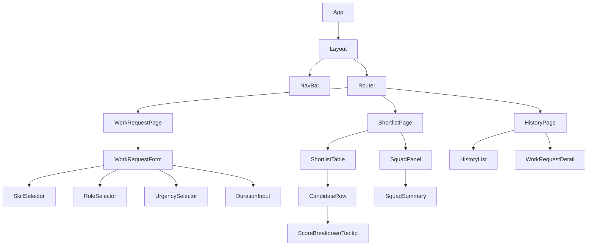

# UI Specification: Squad Assembly

## Component Hierarchy



## Component Responsibilities

| Component | Responsibility |
|-----------|---------------|
| `WorkRequestForm` | Captures all work request fields, validates client-side, submits to API |
| `SkillSelector` | Multi-select from predefined skills (fetched from `/api/skills`), enforces 1-20 limit |
| `RoleSelector` | Multi-select from predefined roles (fetched from `/api/roles`), enforces 1-10 limit |
| `UrgencySelector` | Radio group for urgency levels, no default selected |
| `ShortlistTable` | Displays ranked candidates with checkboxes for squad selection |
| `CandidateRow` | Single candidate display with score, skills, availability indicator |
| `ScoreBreakdownTooltip` | Expandable score factor breakdown on click |
| `SquadPanel` | Shows selected candidates, skill coverage, confirm button |
| `HistoryList` | Paginated list of past work requests with status |
| `WorkRequestDetail` | Full details of a selected work request including squad if assembled |

## State Management

For prototype simplicity, the client uses:

- **`useState`** for local component state (form fields, selections)
- **`useEffect` + `fetch`** for API calls with loading/error states
- **Custom hooks** to encapsulate API logic:
  - `useSkills()` — fetches available skills
  - `useRoles()` — fetches available roles
  - `useWorkRequests(page)` — paginated work request history
  - `useShortlist(workRequestId)` — fetches scored shortlist
  - `useSquadMutation()` — saves squad selection

No external state management library (Redux, Zustand) — the app has minimal cross-component state needs at this scale.

## Client-Side Error Handling

```typescript
// Shared error state pattern for all API hooks
interface ApiState<T> {
  data: T | null;
  isLoading: boolean;
  error: string | null;
  retry: () => void;
}
```

- **Form submissions**: On error, retain all form data and show error message. User can retry without re-entering.
- **Squad save failures**: Retain checkbox selection state. Show error toast with retry button.
- **List/history failures**: Show error state with retry action. No data loss since it's read-only.
- **Network timeouts**: Treat as server error. Show "Unable to reach server" message.

## Accessibility Requirements

- Colour-coded availability indicators must meet WCAG 2.1 AA contrast ratio (4.5:1)
- Availability distinction must not rely solely on colour
